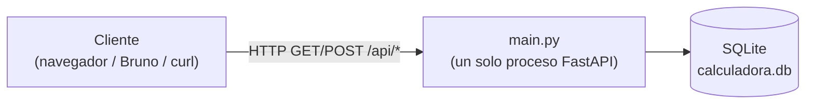

# Arquitectura — Calculadora, variante 1 de 5 (cliente-servidor)

Un solo proceso atiende todas las peticiones; no hay Docker ni
componentes adicionales. Persiste en un archivo SQLite local.

```mermaid
flowchart LR
    cliente["Cliente<br/>(navegador / Bruno / curl)"] -->|"HTTP GET/POST /api/*"| servidor["main.py<br/>(un solo proceso FastAPI)"]
    servidor --> db[("SQLite<br/>calculadora.db")]
```
